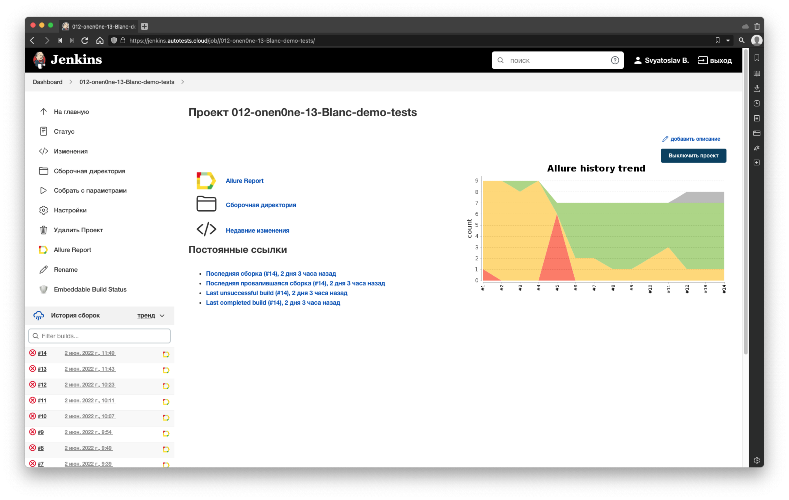
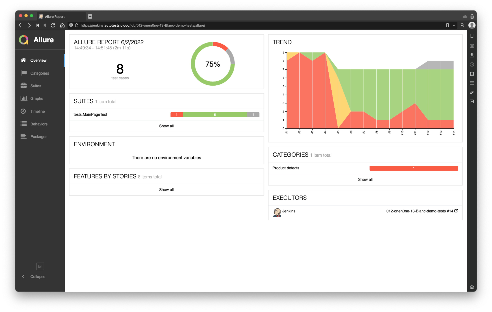
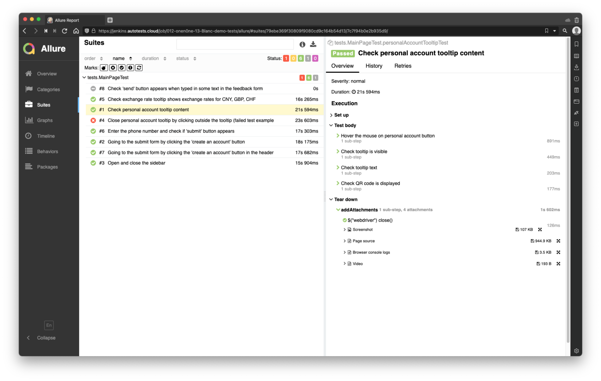
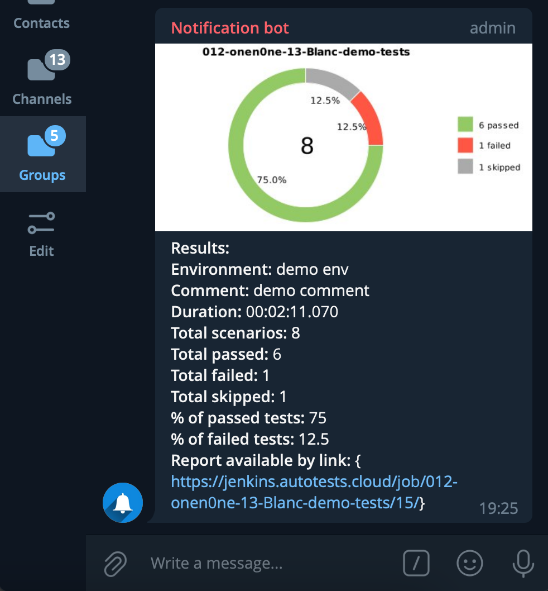

# Демо проект автоматизированного тестирования главной страницы [BLANC банк](https://blanc.ru/)
## Содержание
1. [Стэк](#стэк)
2. [Проверки](#проверки)
3. [Запуск тестов](#запуск-тестов)
4. [Сборка в Jenkins](#Сборка-в-Jenkins)
5. [Allure отчёт](#allure-отчёт)
6. [Видеопример прохождения теста](#видеопример-прохождения-теста)
7. [Уведомления в Telegram](#уведомления-в-Telegram)

## Стэк

<p align="center">


</p>

## Проверки

- Отображение тултипа при наведении указателя на кнопку "Личный кабинет"
- Отображение тултипа с курсами валют
- Открытие / закрытие сайдбара
- Переход к форме подтверждения по клику на кнопку "Открыть счёт"
- Переход к форме подтверждения по клику на кнопку "Открыть счёт" в заголовке страницы
- Ввод номера телефона в форме подтверждения
- Закрытие тултипа "Личный кабинет" при клике вне тултипа (пример упавшего теста)
- Ввод текста в поле для обратной связи (пример деактивированного теста)

## Запуск тестов

#### Параметры запуска
<code>REMOTE</code> - URL хоста для удалённого запуска  

<code>BROWSER</code> – браузер, в котором будут выполняться тесты (по-умолчанию <code>chrome</code>) 

<code>BROWSER_SIZE</code> – размер окна браузера, в котором будут выполняться тесты (по-умолчанию <code>1920x1080</code>)  

#### Локальный запуск с параметрами по-умолчанию
```
gradle clean test
```
#### Локальный запуск с параметерами
```
gradle clean test
-Dremote=${REMOTE}
-Dbrowser=${BROWSER}
-DbrowserSize=${BROWSER_SIZE}
```
#### Запуск с параметрами в Jenkins (Invoke Gradle script task)
```
clean test
-Dremote=${REMOTE}
-Dbrowser=${BROWSER}
-DbrowserSize=${BROWSER_SIZE}
```

## Сборка в Jenkins
[Ссылка на сборку](https://jenkins.autotests.cloud/job/012-onen0ne-13-Blanc-demo-tests/)

<p align="left">

</p>

## Allure отчёт

<p align="left">

</p>

<p align="left">

</p>

## Видеопример прохождения теста

В отчёте к каждому тесту прикладывается видео с прохождением этого теста. Ниже пример прохождения одного из тестов.

#### Enter the phone number and check if 'submit' button appears

<p align="left">

</p>

## Уведомления в Telegram

По завершении тестов отправляется краткий отчёт в Telegram

<p align="left">

</p>

